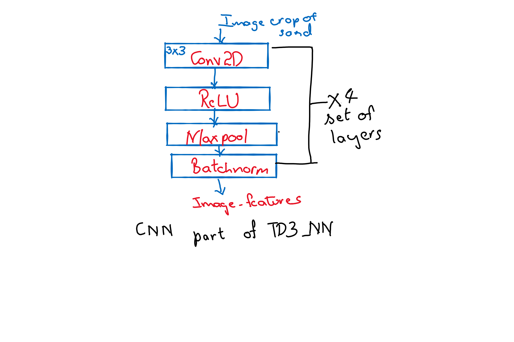
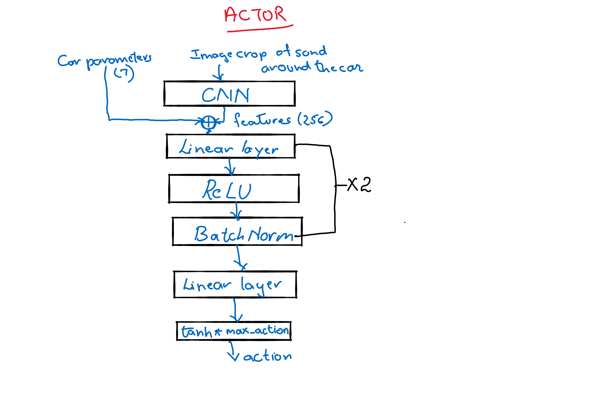
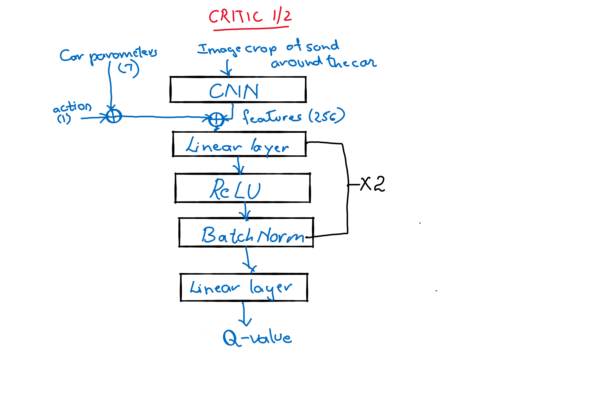

# Self Driving car using Kivy and TD3

### GameMain.py:
This is the main py file. Here the kivy environment of Assignment 7 was modified to use the T3D from Assignment 10, to drive the car on the map.
The car is initialized in a random positions. 
Initially for 10000 time steps the car takes random action to fill the experience replay buffer. For the next 10000 time steps the TD3 is trained. The model is used after 10000 timesteps for maximum 500000 steps.

The car movement is not shown accurately in the output video since the screen recorder app was slowing down the program execution and display.

### The State of the car in CarEnv.py
##### CNN features:
* The the cut out of the sand/map corresponding to the position of the car is one of the inputs to the TD3. It shows the density and shape of the road around the car which can help in deciding the next action. Now the TD3 has CNN layers to get features of this image crop within it.

##### Other State parameters, 7 of them to add more information of the state to TD3:
* The position of the car: x ,y
* The angle of the car,  angle
* The velocity of the car: Velocity xv, yv
* The distance from the goal: xx, yy

##### TD3_NN
Just as earlier the Actor model and Critic model has a couple of Fully connected layers with Relu activation for the hidden layers, and the Actor model also has a Tanh activation at the end. 
Convolutional layers were added to process the image crop of the sand at the car position. Batch normalization was added to all the Convolutional layers and the Fully connected layers except the last one, it helped in getiing regularised output to some extent as opposed to earlier when the output of the Actor was always towards the extreme. 

### Action for the car:
The Action is the output of the TD3 model is one value which represent the angle to be taken by the car. The value of the action represents the quantity of the action. Currently the speed on the sand and the road and kept fixed, just as before.
Further I would have wanted to add the speed as another action parameter that should be predicted by the TD3 model.

### Rewards:
The rewards play a key role in how an agent learns using reinforcement. The reward system of Assignment 7 is reused, although I tried different reward systems. But it can definitely be improved. Currently there are different rewards given to different results of the action. 
- A high positive reward of 100 and done-episode set to True for reaching the goal.
- A high negative of -10 reward/done-episode set to True for hitting the wall.
- A positive reward of 1 for staying on the road.
- A negative reward of -1 for staying on the sand.
- A positive reward of 1 for travelling closer to the goal.

The exact value of the reward may not matter as much as the proportion of the reward given to each scenario. It may take an approach like grid search to reach a good reward system.

### Results:
I have been testing only on my laptop which has just 8GB. It was difficult to move to any cloud environment since I found the dependencies of kivy package tricky. So I had to resize the size of the cropped image of the sand to 40x40 from 160x160.
The Car moves properly while taking random actions. Once the TD3 model is used to predict the action sometimes the car spins or flutters. 

During training and inference the car sometimes spins, sometimes flutters and sometimes moves coherently.

### LSTM
LSTMs can also be considered to use the temporal information of previous states/actions/positions to predict the future action.

### Open AI gym
Initially I spent a lot of time trying to use open AI gym. I would like to further explore how that would help imrpove the design of this project.

## Future corrections and improvements:
There could be a lot of improvements to the defination of state, action, rewards, and how the value action predicted is executed in the environment. 

